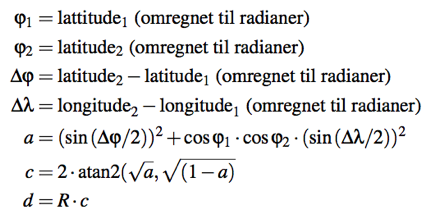

# DAT100: Java Programmering 3 - Uke 4 / 37

**Husk** at oppgave 2,3 og 6 (pkt a. og b.) fra Java Programmering 2 (uke 36) skal gjøres i grupper og demonstreres for underviser eller lab-assistent.

**Husk** også Java quiz'en som har frist i slutten av uke 37.

Oppgave 6 og 7 på denne programmeringslab er relevant for programmeringsprosjektet som begynner i uke 38. De to oppgavene kan gjøres i de gruppene dere har etablert for programmeingsprosjektet.

### Oppgave 1: Lese Java kode - Gruppearbeid

Programmet nedenfor inneheld fire deler. Først studerer kvar student programmet nøye for å finne ut kva som blir skrive ut. Deretter diskuterer gruppen kva som blir skrive ut. Til slutt utfører de programmet og ser om de har rett svar.

```java
public class Oppgave1 {

	public static void main(String[] args) {

		System.out.println("Del 1");
		int i = 1;
		while (i < 1) {
			System.out.println("Nr 1, i = " + i);
		}

		System.out.println("Del 2");
		for (int j = 1; j < 8; j = j * 2) {
			System.out.println("Nr 2, j = " + j);
		}

		System.out.println("Del 3");
		String s = "Test";
		for (int k = s.length() - 1; k > 0; k = k - 1) {
			System.out.println("Nr 3, k = " + s.charAt(k));
		}

		System.out.println("Del 4");
		int tall = 7569;
		int hjelp = tall;
		int aS = 0;
		do {
			hjelp = hjelp / 10;
			aS = aS + 1;
		} while (hjelp > 0);

		System.out.println(tall + " <fyll inn> " + aS + " <fyll inn>");
	}
}
```

### Oppgave 2: Tabeller («arrays») og strenger

##### a)

Lag en klasse med en main-metode som leser antall ord og oppretter en strengtabell (String-array) med den gitte størrelsen. Les deretter ordene fra brukeren og plasser dem i tabellen. Skriv ut  tabellen for å se at ordene er kommet inn.

##### b)

Utvid main-metoden så den leser inn et mønster (streng) fra tastatur (terminal). Tell hvor mange ord i tabellen fra pkt. b) som inneholder mønsteret og skriv ut svaret.

Hint: studer dokumentasjon for String-klassen tilgjengelig via:
http://docs.oracle.com/javase/8/docs/api/index.html

Se om der finnes en metode for å teste om en streng inneholder en gitt sekvens av tegn (char).

##### c)

Gå gjennom tabellen og skriv ut de midterste tegnene i hver streng der du bruker følgende regler. Dersom strengen inneholder bare ett tegn, skrives hele strengen ut. Dersom lengden er partall, skal de to midterste tegnene skrives ut. Dersom strengen har odde lengde (odde antall tegn), skal de 3 midterste tegnene skrives ut om strengen inneholder 3 tegn eller mer.

### Oppgave 3: Repetisjonsløkke og matematiske funksjoner

Ved å bruke Math-klassen får du tilgang til matematiske funksjoner som sinus og cosinus ved å bruke `Math.sin(x)` og `Math.cos(x)` i koden. Når du f.eks. skal regne ut verdien `y = sin(x)`, må *x* være i *radianer*.

Omregning mellom grader og radianer gjør du ved formelen:

vinkel i radianer = (π * vinkel i grader) / 180

Verdien π finst i Math-klassen som konstanten `Math.PI`.

Alternativ kan du bruke en innebygd metode i Math-klassen for dette. Se dokumentasjonen for Math-klassen (http://docs.oracle.com/javase/8/docs/api/index.html) for å finne metoden for omregning mellom grader og radianer.

Lag en enkel klasse der du i main-metoden skriver ut en tabell over sinus og cosinus til alle vinkler mellom 0 og 180 grader, i steg på 15 grader.

Utskriften kan f. eks. se slik ut:

```
  x i grader  x i radianer    sin(x)    cos(x)
------------------------------------------------
           0         0.000     0.000     1.000
          15         0.262     0.259     0.966

          ..            ..        ..        ..

         180         3.142     0.000    -1.000
------------------------------------------------
```

### Oppgave 4: Tabeller

Du skal lage et program for å lese inn temperaturen i Bergen for et bestemt klokkeslett for alle dager i en bestemt uke (dvs. 7 temperaturer). Temperaturer skal lagres i en tabell.

Programmet skal videre finne og skrive ut gjennomsnittet av disse verdiene og den høyeste temperaturen for hele uken.

Skjermdialogen kan se ut som eksempelet nedenfor:

```
Analyse av temperaturer
***********************
Skriv inn temperaturene:
1. dag: 22.2
2. dag: 21.5
3. dag: 26.5
..
7. dag: 18.3

Gjennomsnittstemperaturen var 22.1
Maksimum for denne uken var 26.5 grader
```

### Oppgave 5: Strenger

Metodane nedanfor skal vere klassemetodar (static). Plasser dei ein eigen klasse og lag eit main-program som testar metodane.

##### a)

Lag ein metode som skriv ut ein streng baklengs.

##### b)

Lag ein metode for å avgjere om ein array (tabell) av heiltal er sortert stigande (dvs. at alle tal skal vere større enn det forrige).

##### c)

Lag ein metode som gitt ein tabell av tekststrengar, returnerer den strengen i tabellen som kjem først i (Unikode) alfabetet. Hint: sjå API dokumentasjon for String-klassen for metodar til samanlikning av strenger.

##### d)

Ekstra oppgåve: Implementer sjølv en metode svarande til metoden frå String-klassen brukt i c).
Du skal bruke løkke.

### Oppgave 6: Søylediagram

Gjør oppgave 18, side 78 i Java boken.

Oppgaven er relevant som oppvarming til programmeringsprosjektet.  Husk at i EasyGraphics koordinatsystem går *x* bortover og *y* nedover (se side 71 i Java boken).

### Oppgave 7: GPS punkter

Et GPS punkt (Global Positioning System) inneholder bla. en breddegrad (engelsk: latitude) og en lengdegrad (engelsk: longitude) som angir en posisjon på jordkloden.

Nedenfor skal du implementere noen metoder som gjør beregninger på GPS posisjoner.

Legg inn metoderne i en klasse `GPSUtils.java`. Skriv også en main-metode i klassen som kaller metoderne i deloppgave a) - d) og sjekk om resultat fra metoderne er korrekt.

##### a)

Avstanden *d* i meter mellom to punkter (lattitude1,longtitude1) og (lattitude2,longitude2) angitt ved bredde og lengdegrad kan beregnes ved bruk av Haversine-formlen
[ https://en.wikipedia.org/wiki/Haversine_formula ]



Implementer en metode

```java
static double distance(double latitude1, double longitude1,
                       double latitude2, double longitude2)
```

som bruker Math-klassen: https://docs.oracle.com/javase/8/docs/api/java/lang/Math.html til å beregne avstand mellom to GPS punkter der *R = 6371000* m er jordens gjennomsnittsradius.

##### b)

Implementer en metode

```java
static double speed(int secs,
                    double latitude1, double longitude1,        
                    double latitude2, double longitude2)
```

som beregninger gjennomsnittshastighet i km/t om man beveger seg fra punktet gitt ved (latitude1,longitude1) til punktet (latitude2,longitude2) på det antall sekunder som er gitt med parameteren *secs*.

##### c)

Implementer en metode

```java
static String printDouble(double d)
```

som runder av et flyttall til to desimaler, setter resultat inn i en streng og fyller på med mellomrom foran i strengen slik at lengden på strengen blir 10.

##### d)

Implementer en metode

```java
static public static String printTime(int secs)
```

som returnerer en streng der tiden i sekunder fra midnatt gitt av parameteren *secs* skrives på formatet `hh:mm:ss` der `hh` er antall timer, `mm` er antall minutter og `ss` er antall sekunder.
