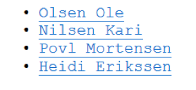

# DAT100: Java Programmering 7 - Uke 10 / 43

Oppgavene 3 og 4 på denne programmeringslab vil inngå i siste obligatoriske programmeringsinnlevering som er neste uke.

Startkode til oppgave 1 og 2 finnes også i prosjektet JPL8 på github: https://github.com/dat100hib/H2017/tree/master/programmering/jplap8

### Oppgave 1 - Filer og unntak

Koden nedenfor finnes i klassen `LeseFrafil.java`, pakken `no.hvl.dat100.lesinnfil` i JPL8 Eclipse-prosjektet.

Main-metoden leser inn navn på fil og etterpå skrives hver linjen i filen ut.

```java
public class LeseFraFil {

	static String MAPPE_STR = System.getProperty("user.dir") + "/src/no/hvl/dat100/lesinnfil/";

	static public void main(String[] args) throws FileNotFoundException {

		String filnavn;

		filnavn = JOptionPane.showInputDialog("Filnavn i mappen " + MAPPE_STR);

		File file = new File(MAPPE_STR + filnavn);
		Scanner reader = new Scanner(file);

		int linenumber = 1;

		// les innhold i filen linje for linje
		String line;

		while (reader.hasNextLine()) {
			line = reader.nextLine();
			System.out.println(linenumber + " " + line);
			linenumber++;
		}

		reader.close();

		// JOptionPane.showMessageDialog(null, "Filen " + filnavn + " finnes
		// ikke. \n" + e.getMessage());
	}
}
```

##### a)

Unntaket `FileNotFoundException` kan kastes/signaleres om filen vi forsøker å åpne ikke kan finnes. Siden det er et sjekket-unntak må vi bruke en throws-klausul for å angi at koden potensielt kan signalere et slik unntak. Kjør programmet – hva skjer om filen ikke finnes?

##### b)

Skriv koden ovenfor om slik der brukes en try-catch blokk til å forsøke å lese inn innholdet i filen og slik unntaket fanges opp med en catch og en feilmelding gis til brukeren. Kjør programmet – hva skjer nå om filen ikke finnes?

##### c)

Utvid programmet slik bruken får et antall forsøk til å angi en fil som finnes.

### Oppgave 2 - Flerdimensjonaletabeller

For denne oppgaven kan det vært lurt å se på forelesningsnotater fra Forelesning 10.

Koden nedenfor finnes i klassen `miniExcel.java`, pakken `no.hvl.dat100.miniexcel`.

Programmet inneholder en to-dimensjonal tabell svarende til et Excel-ark med 4 rekker og 3 søyler med heltall.

```java
package no.hvl.dat100.miniexcel;

public class MiniExcel {

	private static int[][] data =
{ { 1, 2, 0 }, { 3, 4, 0 }, { 5, 6, 0 }, { 0, 0, 0 } };

	public static void skrivUt() {

		System.out.println("---------------");

		// TODO - START

		// iterer igjennom tabellen og skriv ut - utvidet for-løkke

		// TODO _END

		System.out.println("---------------");
	}

	public static void beregnSum() {

		// TODO - START

		// summer hver rad og skriv summen i siste element

		// TODO - END


		// TODO - START

		// summer hver kolonne og skrive summen i siste element

		// TODO - END

	}

	public static void main(String args[]) {

		skrivUt();

		beregnSum();

		skrivUt();
	}
}
```

##### a)

Implementer metoden `skrivUt()` som skriver ut tabellen på formen

```
-----
1 2 0
3 4 0
5 6 0
0 0 0
-----
```

##### b)

Implementer metoden `beregnSum()` som summer sammen rekker og søyler og skrive summen i siste posisjon. Dvs. utskrift etter sum er beregnet skal bli:

```
------
1 2 3
3 4 7
5 6 11
9 12 0
------
```

De to metodene i a) og b) skal fungere generelt – dvs. ikke kun for en tabell med størrelse 4x3.

### Oppgave 3 - Klasser og subklasser

##### a)

Implementer en klasse `Person` og to subklasser `Student` og `Laerer` med følgende egenskaper:

- Person

  * Objektvariabler: etternamn (String), fornamn (String), fødselsår (int), kjønn (tegn, ‘k’ eller ‘m’)

  * Konstruktører: standard konstruktør og konstruktør med 4 parametre som kan gi verdi til alle objektvariablene

  * Metoder: `toString()` som returnerer data i objektet som en streng

-	Student

  * Ekstra objektvariabler: studentnummer (int, 6 siffer), klasse (String)

  * Konstruktør med 6 parametre

  * Metoder: `toString()` som returnerer data i objektet som en streng

- Lærer

  * Ekstra objektvariable: månadsløn (int), kontornummer (int)

  * Konstruktør med 6 parametre

  * Metoder: `toString()` som returnerer data i objektet som en streng

Bruk private/protected på alle objektvariabler og lag public get-metoder / set-metoder.

##### b)

Lag en klasse med en enkel main()–metode for å teste klassene over.

- I `main()` skal du først lage en tabell av referanser til fire Person-objekter. Opprett to Student-objekter og to Lærer-objekter der du gir data direkte inn i parameterlista på alle fire.

- Gå gjennom tabellen og skriv ut alle data om de fire objektene.

### Oppgave 4 - Objektsamlinger

Ta utgangpunkt i programmet fra oppgave 3. I stedet for å ha objektene direkte i en tabell i main som i 3b, skal vi definere en samling av person-objekter via en klasse `PersonSamling` som inneholder en tabell. Personobjektene skal lagres sammenhengene fra starten av tabellen.

Samlingen skal inneholde

1.	Objektvariabler: nesteLedige/antall
en referanse til tabell med personreferanser

2.	En konstruktør der en kan angi startstørrelsen på tabellen (kan utvides ved behov).

3.	En metode `leggTil(Person p)`. Metoden skal legge personen på neste ledige plass i tabellen. Dersom tabellen er full, skal du lage en ny tabell som er dobbelt så stor og flytte elementene over i denne. Deretter setter du inn personen i den nye tabellen.

4. En metode `skrivut()`. Metoden skal skrive ut samlingen ved hjelp av `toString()`-metoden for Lærer/Student.

5. En metode `eldst()` som returnerer personen som er eldst. Anta at ingen personer er fødd samme året.

6. En metode `statistikk()` som skriver ut en enkel statistikk over personene i samlingen på følgende måte:

```
Statistikk
Kvinner: 10
Menn: 10
Personer totalt: 20
```

7. Om man ønsker oversikt over antall studenter og antall lærere er det litt mer komplisert, men det lar seg for eksempel gjøre ved å `instanceof()`, se side 377 i læreboken.

```
Statistikk
Studenter: 14
Lærere: 6
Personer totalt: 20
```

### Ekstra oppgave – HTML Filer

##### a)

Udvid klassene fra Oppgave 3 og 4 så de får en metode `tilHTML()` som returnerer en streng inneholdende en (simpel) HTML representasjonen av verdier for objekt variable i objektet.

**Eksempel:** En mannlig lærer født 1954 med kontor på 503 og månedslønn på 20000:

<html>
<ul>
<li>Povl Mortensen</li>
<li>MANN 1954</li>
<li>503 20000</li>
</ul>
</html>

##### b)

Implementer en metode `tilHTMLfil()` i programmet som kan skrive ut HTML representasjonen for en Person (Student eller Lærer) i en navngiven fil. Navn på filen skal bestemmes utefra etternamn på personen. I eksemplet ovenfor blir det da `mortensen.html`.

##### c)

Utvid programmet videre så den kan skrive ut en tabell av referanser til Person-objekt (en Person per fil) til en `index.html` fil med lenker til HTML filene fra b) for de enkelte objekt.

Eksempel: Filen `index.html` vist i en nettleser skal se ut som:


